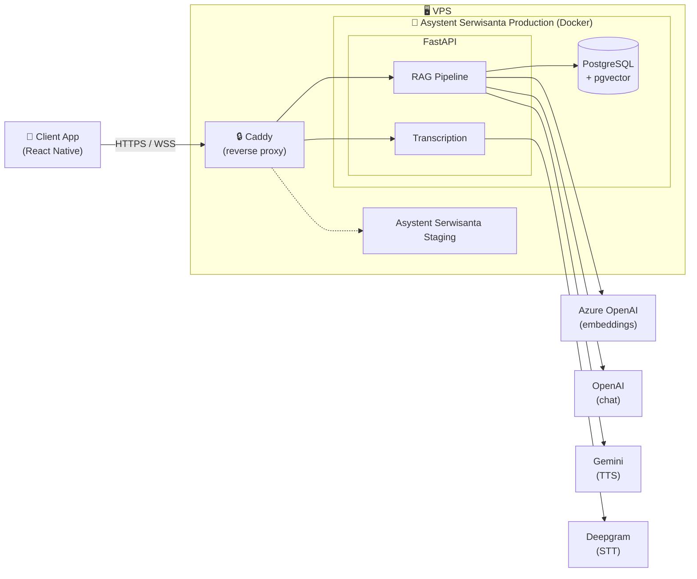
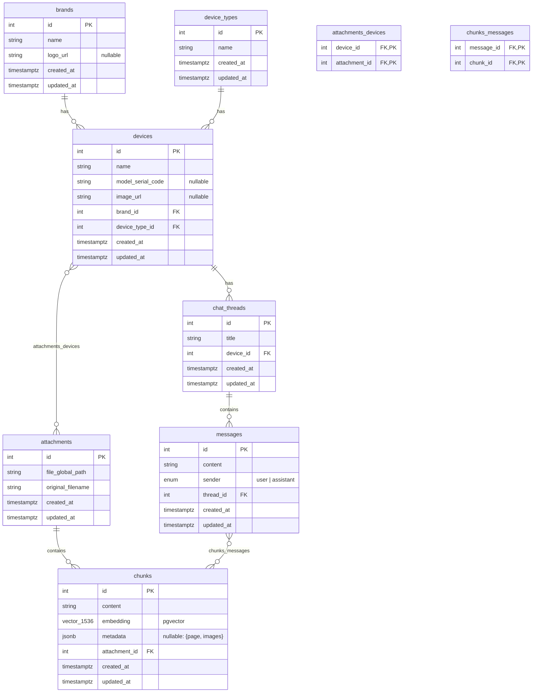
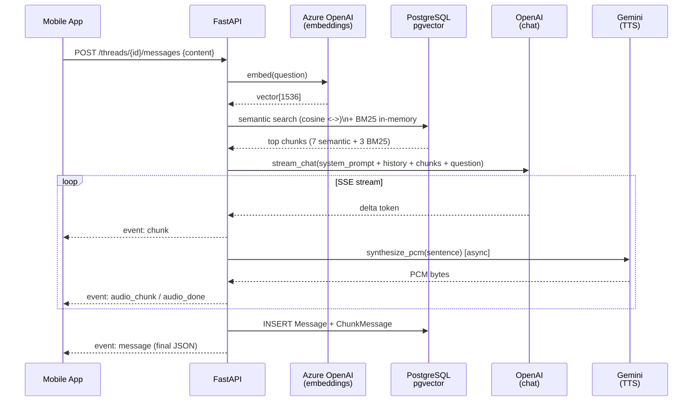
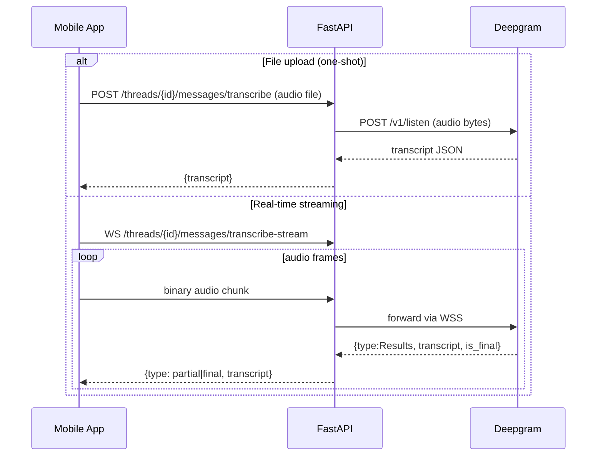

# Presentation

## Used Technologies

### 📱 Client
| Kategoria | Technologia |
|-----------|-------------|
| Język | TypeScript |
| Framework | React Native + Expo |

### 🖥️ Server
| Kategoria | Technologia |
|-----------|-------------|
| Język | Python |
| Framework | FastAPI |
| Baza danych | PostgreSQL + pgvector |

### ☁️ Infrastruktura
| Kategoria | Technologia |
|-----------|-------------|
| Hosting | VPS (Docker + Docker Compose) |
| Embeddingi | Azure OpenAI |
| Chat LLM | OpenAI |
| STT | Deepgram |
| TTS | Google Gemini |

## System Overview

## Database Schema

## RAG pipeline (message flow)

## Voice transcription flow

