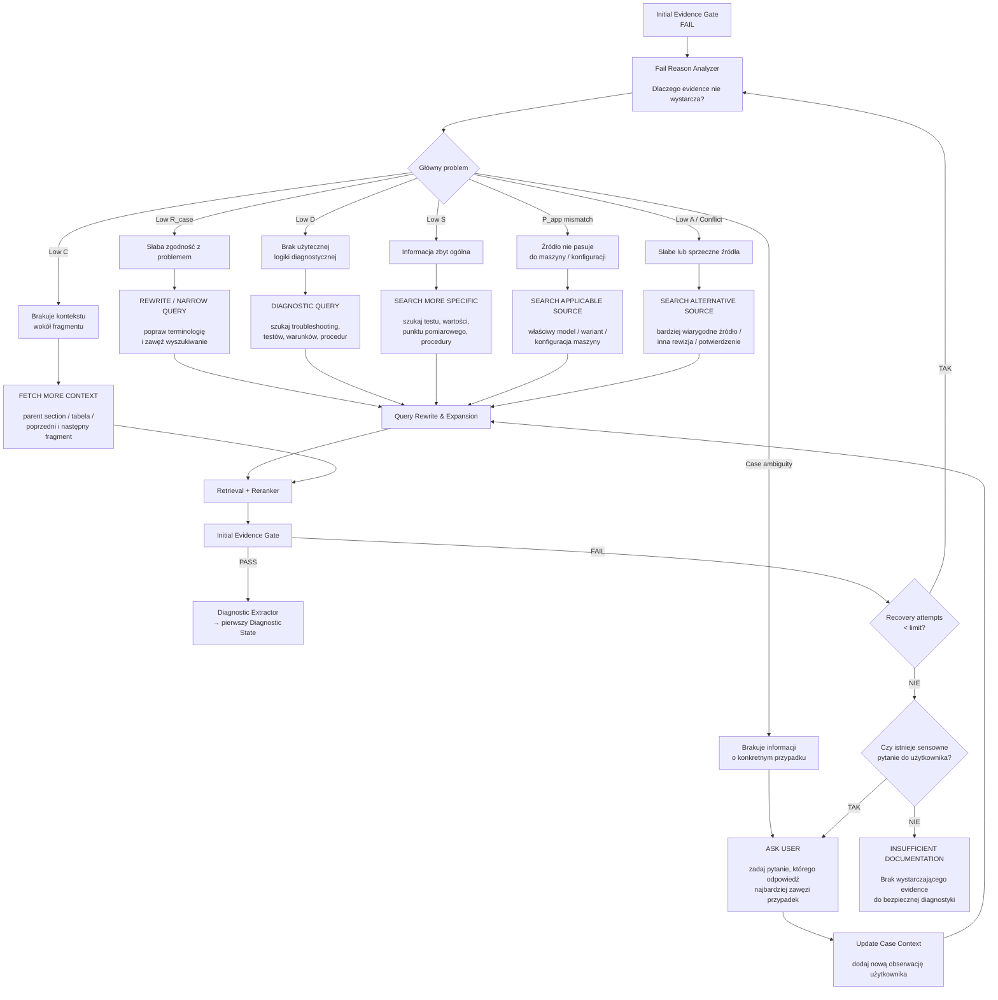

# Fixo — architektura Best Next Step (układ pionowy)

```mermaid
flowchart TD

    A["Initial Evidence Gate<br/>FAIL"]

    B["Fail Reason Analyzer<br/><br/>Dlaczego evidence nie wystarcza?"]

    A --> B

    %% =========================
    %% PROBLEM TYPES
    %% =========================

    B --> R{"Główny problem"}

    R -->|"Low R_case"| R1["Słaba zgodność z problemem"]
    R -->|"Low D"| D1["Brak użytecznej<br/>logiki diagnostycznej"]
    R -->|"Low S"| S1["Informacja zbyt ogólna"]
    R -->|"Low C"| C1["Brakuje kontekstu<br/>wokół fragmentu"]
    R -->|"P_app mismatch"| P1["Źródło nie pasuje<br/>do maszyny / konfiguracji"]
    R -->|"Low A / Conflict"| A1["Słabe lub sprzeczne źródła"]
    R -->|"Case ambiguity"| U1["Brakuje informacji<br/>o konkretnym przypadku"]

    %% =========================
    %% RECOVERY ACTIONS
    %% =========================

    R1 --> QR["REWRITE / NARROW QUERY<br/><br/>popraw terminologię<br/>i zawęź wyszukiwanie"]

    D1 --> DQ["DIAGNOSTIC QUERY<br/><br/>szukaj troubleshooting,<br/>testów, warunków, procedur"]

    S1 --> SQ["SEARCH MORE SPECIFIC<br/><br/>szukaj testu, wartości,<br/>punktu pomiarowego, procedury"]

    C1 --> FC["FETCH MORE CONTEXT<br/><br/>parent section / tabela /<br/>poprzedni i następny fragment"]

    P1 --> PS["SEARCH APPLICABLE SOURCE<br/><br/>właściwy model / wariant /<br/>konfiguracja maszyny"]

    A1 --> AS["SEARCH ALTERNATIVE SOURCE<br/><br/>bardziej wiarygodne źródło /<br/>inna rewizja / potwierdzenie"]

    U1 --> ASK["ASK USER<br/><br/>zadaj pytanie, którego odpowiedź<br/>najbardziej zawęzi przypadek"]

    %% =========================
    %% USER PATH
    %% =========================

    ASK --> UC["Update Case Context<br/><br/>dodaj nową obserwację użytkownika"]
    UC --> QE["Query Rewrite & Expansion"]

    %% =========================
    %% SEARCH PATHS
    %% =========================

    QR --> QE
    DQ --> QE
    SQ --> QE
    PS --> QE
    AS --> QE

    QE --> RET["Retrieval + Reranker"]

    %% Context fetch can go directly back to evidence
    FC --> RET

    %% =========================
    %% RETRY CONTROL
    %% =========================

    RET --> G["Initial Evidence Gate"]

    G -->|"PASS"| PASS["Diagnostic Extractor<br/>→ pierwszy Diagnostic State"]

    G -->|"FAIL"| COUNT{"Recovery attempts<br/>< limit?"}

    COUNT -->|"TAK"| B

    COUNT -->|"NIE"| LAST{"Czy istnieje sensowne<br/>pytanie do użytkownika?"}

    LAST -->|"TAK"| ASK

    LAST -->|"NIE"| STOP["INSUFFICIENT DOCUMENTATION<br/><br/>Brak wystarczającego evidence<br/>do bezpiecznej diagnostyki"]
```
