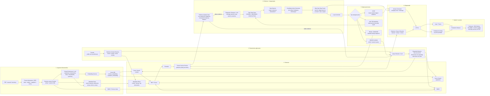

# Fixo — systemy potrzebne do działania Best Next Step

```mermaid
flowchart LR

    %% =========================
    %% INGESTION
    %% =========================
    subgraph INGEST["1. Ingestion dokumentów"]
        A["PDF / manual / instrukcja"]
        B["Parser dokumentu / OCR<br/>tekst + tabele + nagłówki + strony"]
        C["Structure-aware Chunker<br/>sekcje + parent-child"]
        D["Chunk Enrichment / LLM<br/>symptomy, komponenty,<br/>akcje, kody błędów, synonimy"]
        E["Embedding Service"]
        F["Vector DB<br/>content_embedding<br/>symptom_embedding"]
        G["BM25 / Full-text Index"]
        H["Metadata Store<br/>model maszyny, dokument,<br/>sekcja, strona, wersja"]

        A --> B
        B --> C
        C --> D
        D --> E
        E --> F
        C --> G
        C --> H
        D --> H
    end

    %% =========================
    %% QUERY
    %% =========================
    subgraph QUERY["2. Rozumienie zgłoszenia"]
        U["Technik<br/>„widły się nie podnoszą”"]
        Q1["Machine Context Resolver<br/>marka / model / numer seryjny"]
        Q2["Query Rewriter / LLM"]
        Q3["Expanded Queries<br/>forks do not lift<br/>lift function not operating<br/>mast does not raise"]

        U --> Q1
        Q1 --> Q2
        Q2 --> Q3
    end

    %% =========================
    %% RETRIEVAL
    %% =========================
    subgraph RET["3. Retrieval"]
        R1["Vector Search<br/>content"]
        R2["Vector Search<br/>symptoms"]
        R3["BM25"]
        R4["Metadata Filters<br/>model / wersja / typ dokumentu"]
        R5["RRF / Fusion"]
        R6["Reranker"]
        R7["Parent Section Fetcher<br/>pobranie pełnej procedury"]

        Q3 --> R1
        Q3 --> R2
        Q3 --> R3
        Q1 --> R4

        F --> R1
        F --> R2
        G --> R3
        H --> R4

        R1 --> R5
        R2 --> R5
        R3 --> R5
        R4 --> R5
        R5 --> R6
        R6 --> R7
    end

    %% =========================
    %% REASONING
    %% =========================
    subgraph REASON["4. Evidence + diagnostyka"]
        S1["Evidence Quality Gate<br/>czy znalezione fragmenty<br/>rzeczywiście dotyczą objawu?"]
        S2["Diagnostic Extractor / LLM<br/>wyciąga warunki, testy,<br/>wyniki i przejścia"]
        S3["Task State Store<br/>KNOWN / UNKNOWN / CONFLICTING"]
        S4["Gap Detector<br/>czego trzeba się dowiedzieć?"]
        S5["Candidate Action Generator<br/>jak zdobyć brakującą informację?"]
        S6["Best Next Step Scorer<br/>wartość diagnostyczna<br/>vs koszt / czas / ryzyko"]
        S7["Loop Controller"]

        R7 --> S1
        S1 -->|dobre evidence| S2
        S2 --> S3
        S3 --> S4
        S4 --> S5
        S5 --> S6
        S6 --> S7
    end

    %% =========================
    %% LOOP
    %% =========================
    subgraph EXEC["5. Wykonanie kroku"]
        X1{"Typ następnej akcji"}
        X2["SEARCH AGAIN<br/>zmień / poszerz query"]
        X3["ASK TECHNICIAN<br/>wykonaj test lub podaj wynik"]
        X4["READ / COMPARE<br/>sprawdź kolejny fragment"]
        X5["STOP<br/>mamy wystarczające evidence"]

        S7 --> X1
        X1 --> X2
        X1 --> X3
        X1 --> X4
        X1 --> X5

        X2 --> Q2
        X4 --> R7
        X3 --> S3
    end

    %% =========================
    %% OUTPUT
    %% =========================
    subgraph OUT["6. Odpowiedź"]
        O1["Answer Generator<br/>następny krok + dlaczego"]
        O2["Citations / Source Resolver<br/>manual + sekcja + strona"]
        O3["UI Fixo"]

        X5 --> O1
        S6 --> O1
        R7 --> O2
        O1 --> O3
        O2 --> O3
    end

    %% =========================
    %% OBSERVABILITY
    %% =========================
    subgraph OBS["7. Jakość i uczenie"]
        Z1["Logs / Traces"]
        Z2["Feedback technika<br/>czy krok pomógł?"]
        Z3["Evaluation Dataset"]
        Z4["Retrieval + BNS Metrics<br/>Recall@K, reranker quality,<br/>first-step success, MTTR"]

        O3 --> Z1
        O3 --> Z2
        Z1 --> Z3
        Z2 --> Z3
        Z3 --> Z4
    end

    S1 -->|słabe evidence| Q2
```
