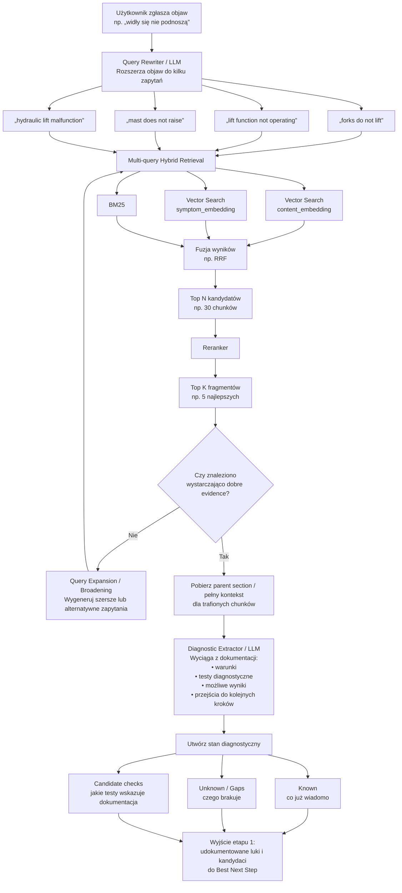

# Fixo — etap 1: retrieval i gap detection

```mermaid
flowchart TD
    A["Użytkownik zgłasza objaw<br/>np. „widły się nie podnoszą”"]

    B["Query Rewriter / LLM<br/>Rozszerza objaw do kilku zapytań"]
    B1["„forks do not lift”"]
    B2["„lift function not operating”"]
    B3["„mast does not raise”"]
    B4["„hydraulic lift malfunction”"]

    C["Multi-query Hybrid Retrieval"]
    C1["Vector Search<br/>content_embedding"]
    C2["Vector Search<br/>symptom_embedding"]
    C3["BM25"]

    D["Fuzja wyników<br/>np. RRF"]
    E["Top N kandydatów<br/>np. 30 chunków"]

    F["Reranker"]
    G["Top K fragmentów<br/>np. 5 najlepszych"]

    H{"Czy znaleziono<br/>wystarczająco dobre evidence?"}

    I["Query Expansion / Broadening<br/>Wygeneruj szersze lub alternatywne zapytania"]
    J["Pobierz parent section / pełny kontekst<br/>dla trafionych chunków"]

    K["Diagnostic Extractor / LLM<br/>Wyciąga z dokumentacji:<br/>• warunki<br/>• testy diagnostyczne<br/>• możliwe wyniki<br/>• przejścia do kolejnych kroków"]

    L["Utwórz stan diagnostyczny"]
    L1["Known<br/>co już wiadomo"]
    L2["Unknown / Gaps<br/>czego brakuje"]
    L3["Candidate checks<br/>jakie testy wskazuje dokumentacja"]

    M["Wyjście etapu 1:<br/>udokumentowane luki i kandydaci<br/>do Best Next Step"]

    A --> B
    B --> B1
    B --> B2
    B --> B3
    B --> B4

    B1 --> C
    B2 --> C
    B3 --> C
    B4 --> C

    C --> C1
    C --> C2
    C --> C3

    C1 --> D
    C2 --> D
    C3 --> D

    D --> E
    E --> F
    F --> G
    G --> H

    H -- "Nie" --> I
    I --> C

    H -- "Tak" --> J
    J --> K
    K --> L

    L --> L1
    L --> L2
    L --> L3

    L1 --> M
    L2 --> M
    L3 --> M

```
