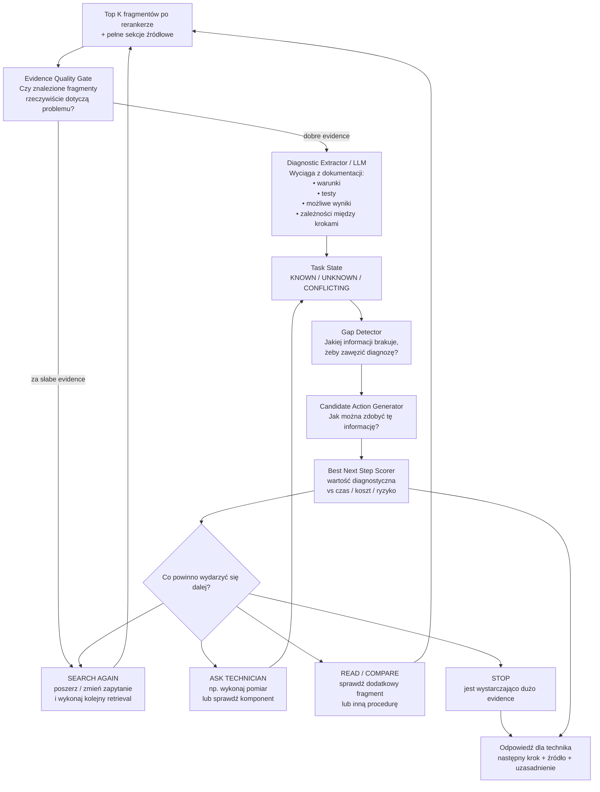

# Fixo — nowy segment: Gap Detection + Best Next Step

```mermaid
flowchart TD

    A["Top K fragmentów po rerankerze<br/>+ pełne sekcje źródłowe"]

    B["Evidence Quality Gate<br/>Czy znalezione fragmenty<br/>rzeczywiście dotyczą problemu?"]

    C["Diagnostic Extractor / LLM<br/>Wyciąga z dokumentacji:<br/>• warunki<br/>• testy<br/>• możliwe wyniki<br/>• zależności między krokami"]

    D["Task State<br/>KNOWN / UNKNOWN / CONFLICTING"]

    E["Gap Detector<br/>Jakiej informacji brakuje,<br/>żeby zawęzić diagnozę?"]

    F["Candidate Action Generator<br/>Jak można zdobyć tę informację?"]

    G["Best Next Step Scorer<br/>wartość diagnostyczna<br/>vs czas / koszt / ryzyko"]

    H{"Co powinno wydarzyć się dalej?"}

    I["SEARCH AGAIN<br/>poszerz / zmień zapytanie<br/>i wykonaj kolejny retrieval"]

    J["ASK TECHNICIAN<br/>np. wykonaj pomiar<br/>lub sprawdź komponent"]

    K["READ / COMPARE<br/>sprawdź dodatkowy fragment<br/>lub inną procedurę"]

    L["STOP<br/>jest wystarczająco dużo evidence"]

    M["Odpowiedź dla technika<br/>następny krok + źródło + uzasadnienie"]

    A --> B
    B -- "dobre evidence" --> C
    B -- "za słabe evidence" --> I

    C --> D
    D --> E
    E --> F
    F --> G
    G --> H

    H --> I
    H --> J
    H --> K
    H --> L

    I --> A
    K --> A
    J --> D

    L --> M
    G --> M
```
