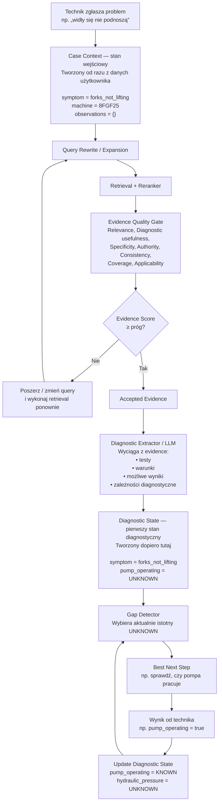

# Fixo — miejsce tworzenia stanu początkowego

## Rozróżnienie stanów

- **Case Context** powstaje przed retrievalem i zawiera tylko fakty już znane z wejścia użytkownika oraz kontekstu maszyny.
- **Diagnostic State** powstaje dopiero po przejściu Evidence Quality Gate i ekstrakcji logiki diagnostycznej z zaakceptowanych źródeł.
