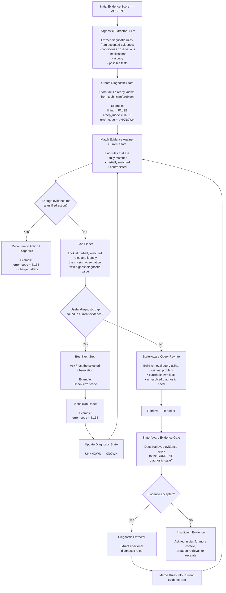

```mermaid
flowchart TD

    A["Initial Evidence Score == ACCEPT"]

    A --> B["Diagnostic Extractor / LLM<br/><br/>Extract diagnostic rules from accepted evidence:<br/>• conditions / observations<br/>• implications<br/>• actions<br/>• possible tests"]

    B --> C["Create Diagnostic State<br/><br/>Store facts already known from technician/problem<br/><br/>Example:<br/>lifting = FALSE<br/>creep_mode = TRUE<br/>error_code = UNKNOWN"]

    C --> D["Match Evidence Against Current State<br/><br/>Find rules that are:<br/>• fully matched<br/>• partially matched<br/>• contradicted"]

    D --> E{"Enough evidence for<br/>a justified action?"}

    E -- Yes --> F["Recommend Action / Diagnosis<br/><br/>Example:<br/>error_code = 8.138<br/>→ charge battery"]

    E -- No --> G["Gap Finder<br/><br/>Look at partially matched rules and identify<br/>the missing observation with highest diagnostic value"]

    G --> H{"Useful diagnostic gap<br/>found in current evidence?"}

    H -- Yes --> I["Best Next Step<br/><br/>Ask / test the selected observation<br/><br/>Example:<br/>Check error code"]

    I --> J["Technician Result<br/><br/>Example:<br/>error_code = 8.138"]

    J --> K["Update Diagnostic State<br/><br/>UNKNOWN → KNOWN"]

    K --> D

    H -- No --> L["State-Aware Query Rewrite<br/><br/>Build retrieval query using:<br/>• original problem<br/>• current known facts<br/>• unresolved diagnostic need"]

    L --> M["Retrieval + Reranker"]

    M --> N["State-Aware Evidence Gate<br/><br/>Does retrieved evidence apply<br/>to the CURRENT diagnostic state?"]

    N --> O{"Evidence accepted?"}

    O -- Yes --> P["Diagnostic Extractor<br/><br/>Extract additional diagnostic rules"]

    P --> Q["Merge Rules Into Current Evidence Set"]

    Q --> D

    O -- No --> R["Insufficient Evidence<br/><br/>Ask technician for more context,<br/>broaden retrieval, or escalate"]
```
