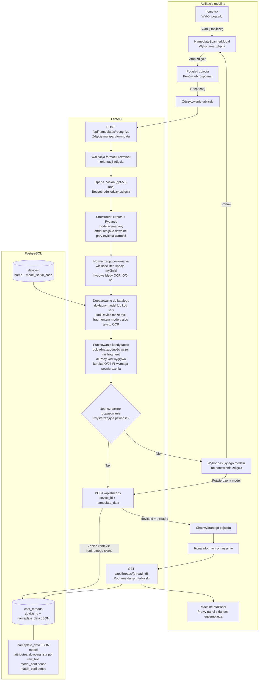

# Nameplate Diagram

```mermaid
flowchart TD
    subgraph Client["Aplikacja mobilna"]
        HOME["home.tsx<br/>Wybór pojazdu"]
        CAMERA["NameplateScannerModal<br/>Wykonanie zdjęcia"]
        PREVIEW["Podgląd zdjęcia<br/>Ponów lub rozpoznaj"]
        LOADING["Odczytywanie tabliczki"]
        CANDIDATES["Wybór pasującego modelu<br/>lub ponowienie zdjęcia"]
        CHAT["Chat wybranego pojazdu"]
        INFO_BUTTON["Ikona informacji o maszynie"]
        INFO_PANEL["MachineInfoPanel<br/>Prawy panel z danymi egzemplarza"]
    end

    subgraph Api["FastAPI"]
        RECOGNIZE["POST /api/nameplates/recognize<br/>Zdjęcie multipart/form-data"]
        VALIDATE["Walidacja formatu, rozmiaru<br/>i orientacji zdjęcia"]
        VISION["OpenAI Vision (gpt-5.6-luna)<br/>Bezpośredni odczyt zdjęcia"]
        PARSE["Structured Outputs + Pydantic<br/>model wymagany<br/>attributes jako dowolne pary etykieta-wartość"]
        NORMALIZE["Normalizacja porównania<br/>wielkość liter, spacje, myślniki<br/>i typowe błędy OCR: O/0, I/1"]
        MATCH["Dopasowanie do katalogu<br/>dokładny model lub kod serii<br/>kod Device może być fragmentem modelu albo tekstu OCR"]
        SCORE["Punktowanie kandydatów<br/>dokładna zgodność wyżej niż fragment<br/>dłuższy kod wygrywa<br/>korekta O/0 i I/1 wymaga potwierdzenia"]
        CONFIDENCE{"Jednoznaczne dopasowanie<br/>i wystarczająca pewność?"}
        SAVE["POST /api/threads<br/>device_id + nameplate_data"]
        DETAILS["GET /api/threads/{thread_id}<br/>Pobranie danych tabliczki"]
    end

    subgraph Storage["PostgreSQL"]
        DEVICES[("devices<br/>name + model_serial_code")]
        THREADS[("chat_threads<br/>device_id + nameplate_data JSON")]
        NAMEPLATE_DATA["nameplate_data JSON<br/>model<br/>attributes: dowolna lista pól<br/>raw_text<br/>model_confidence<br/>match_confidence"]
    end

    HOME -->|"Skanuj tabliczkę"| CAMERA
    CAMERA -->|"Zrób zdjęcie"| PREVIEW
    PREVIEW -->|"Rozpoznaj"| LOADING
    LOADING --> RECOGNIZE
    RECOGNIZE --> VALIDATE
    VALIDATE --> VISION
    VISION --> PARSE
    PARSE --> NORMALIZE
    NORMALIZE --> MATCH
    DEVICES --> MATCH
    MATCH --> SCORE
    SCORE --> CONFIDENCE

    CONFIDENCE -->|"Tak"| SAVE
    CONFIDENCE -->|"Nie"| CANDIDATES
    CANDIDATES -->|"Potwierdzony model"| SAVE
    CANDIDATES -->|"Ponów"| CAMERA

    SAVE -->|"Zapisz kontekst konkretnego skanu"| THREADS
    THREADS --- NAMEPLATE_DATA
    SAVE -->|"deviceId + threadId"| CHAT

    CHAT --> INFO_BUTTON
    INFO_BUTTON --> DETAILS
    DETAILS --> THREADS
    DETAILS --> INFO_PANEL
```
